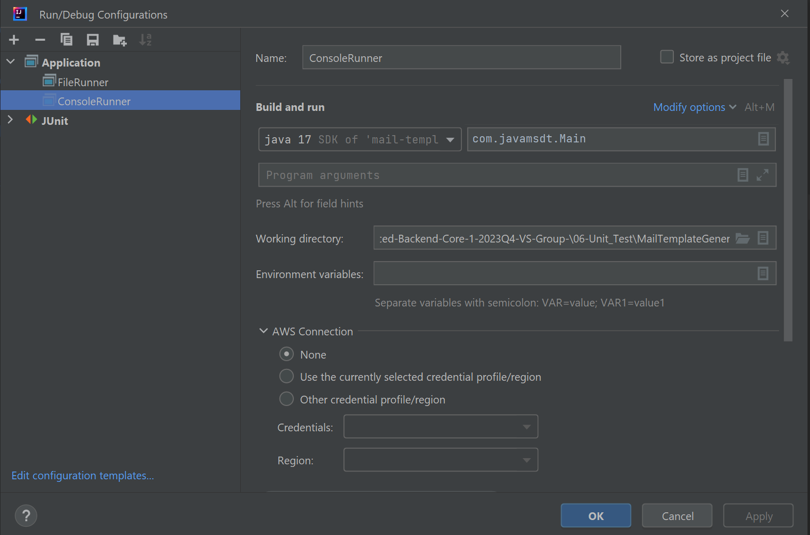
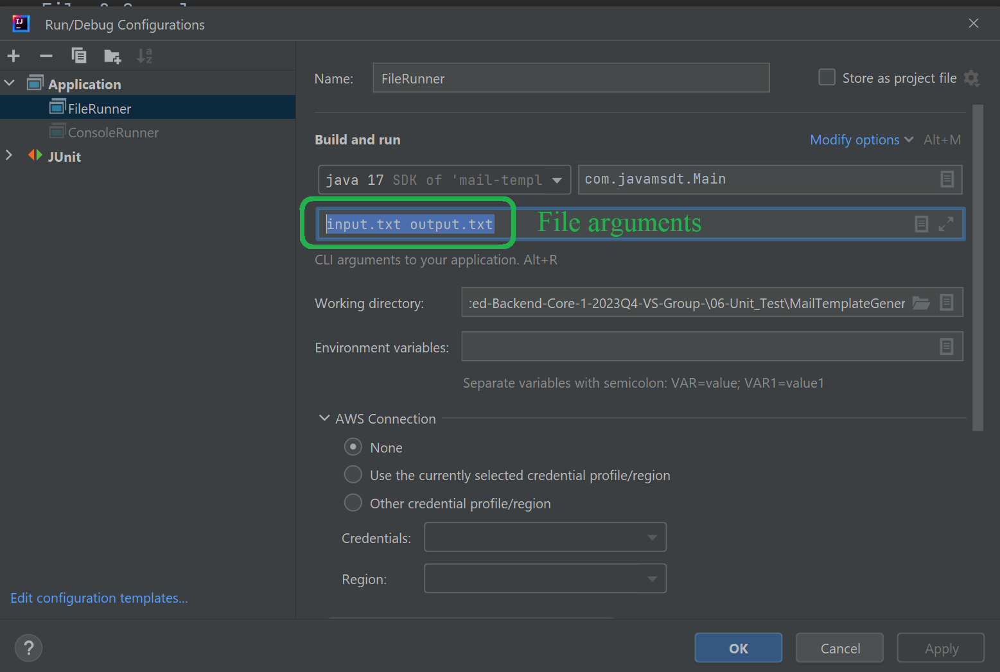

# Template Generator

-
## Description
- A messenger that ill pretend to send emails using custom template generator.
## Requirements
- Use TDD approach for template generator test cases.
## Required implementations
- The system replaces variable placeholders like #{Subject} from a template with
  values provided at runtime.
- If at least one placeholder value is not provided at runtime - template 
  generator should throw an exception.
- Template generator ignores values for variables provided at runtime that
  aren't found from the template.
- System should support values passed in runtime with #{...}, 
  - Template is "some text: " and at runtime #{value} passed as #{tag}.
  - Output should be "some text: #{tag}"
- the system supports the full Latin-1 charset in template and in variables.
- Messenger should work in two modes;
  - Console mode: 
    - Application takes expression from the console.
    - Eg, using Scanner 
      - Scanner prints in the console the following request "Enter the template:"
      - You enter the template as follows "Hello, #{name}!", press Enter.
      - System will ask you to enter the value as follows,
      - Enter runtime values (key=value), type 'done' when finished:
      - name=Samy, press enter, or done to end the process.
      - Method should replace the name in template with the name
        from the runtime value.
      - you can use any key value, name here is just example.
  - File Mode
    - Application takes expression from file then output the results
      to file.
    - input file will contain the template "Hello, #{name}!",
    - output file will contain the results Hello, Samy
    - Using application parameter to point to the file name and path.
    - EG, arg[0]=input.txt arg[1]=output.txt from main method.
    - System will ask you to enter the value as follows,
    - Enter runtime values (key=value), type 'done' when finished:
    - name=Samy, press enter, or done to end the process.
    - Method should replace the name in template with the name
      from the runtime value.
    - you can use any key value, name here is just example.
## Functional Requirements
- Using TDD approach.
- Use @Parametrized test.
- Implement meta annotations and filtering.
- Temporary Folder rule.
- Mock reading from File & Console.
- Use partial mock.
- Use spy.
- Create custom extension (JUnit5) to output test execution information to a file.
- Using ExpectedException rule to check exceptions & Assertion mechanism.
- Implement Disabling test on condition.
- Test quality & adequate coverage will be assessed.
- Write BDD tests. use any framework(Spock, JBehave. Cucumber, etc).
## Development advices
- You can have 2 separate runners, one for console another for file as follows;
- 

- 
- For more check the main class and the test classes

